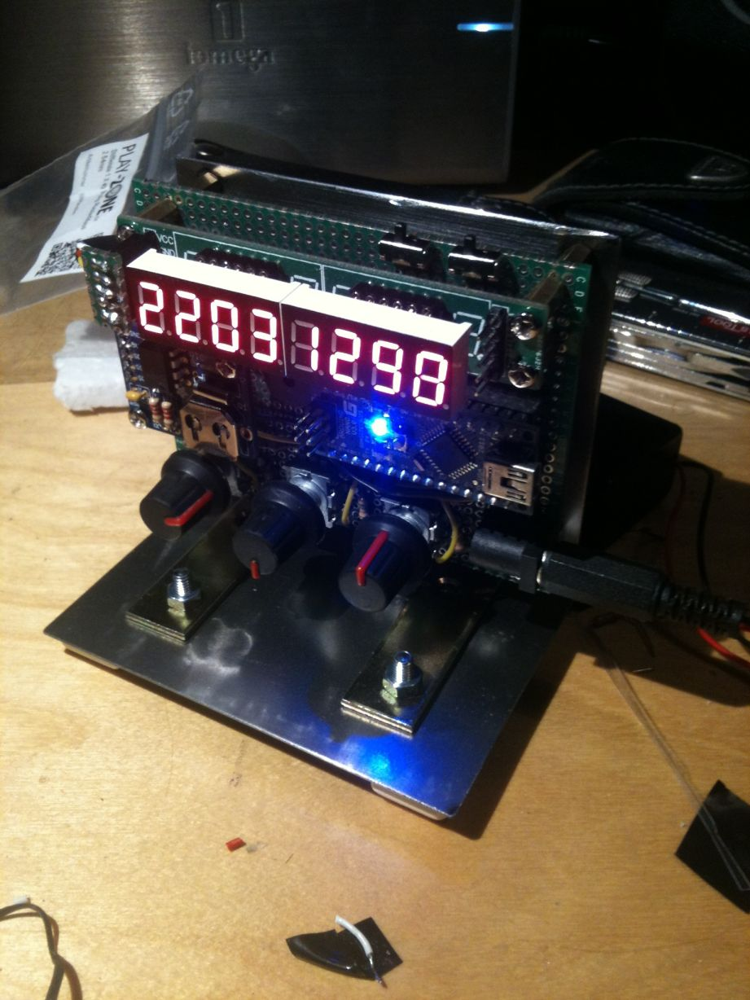
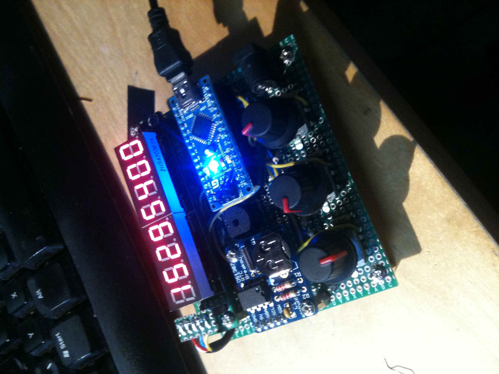

This is one of my earliest electronics project: An alarm clock built around an Arduino nano, a real-time clock (RTC) module and a 7-segment display.

Among other,it features the following functions:

* Alarm clock
* Countdown timer
* Stopwatch
* Automatic brightness using a photoresistor

The device is operated using rotary encodes with integrated push buttons and includes a buzzer for acoustic feedback.

