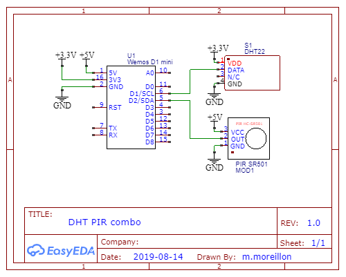

This project consists of an HC-SR501 PIR motion sensor and a DHT22 temperature and humidity sensor connected to a Wemos D1 mini, an ESP8266 breakout board.

MQTT messages are published whenever motion is detected, which can be used for room presence estimation. On the other hand, humidity and temperature are measured and published periodically.

The parts list is pretty straightforward:

* Wemos D1 mini
* HC-SR501 PIR motion sensor
* DHT22 Temperature and humidity sensor

As usual, the source code for the firmware is available on [GitHub](https://github.com/maximemoreillon/dht_pir_combo_json)