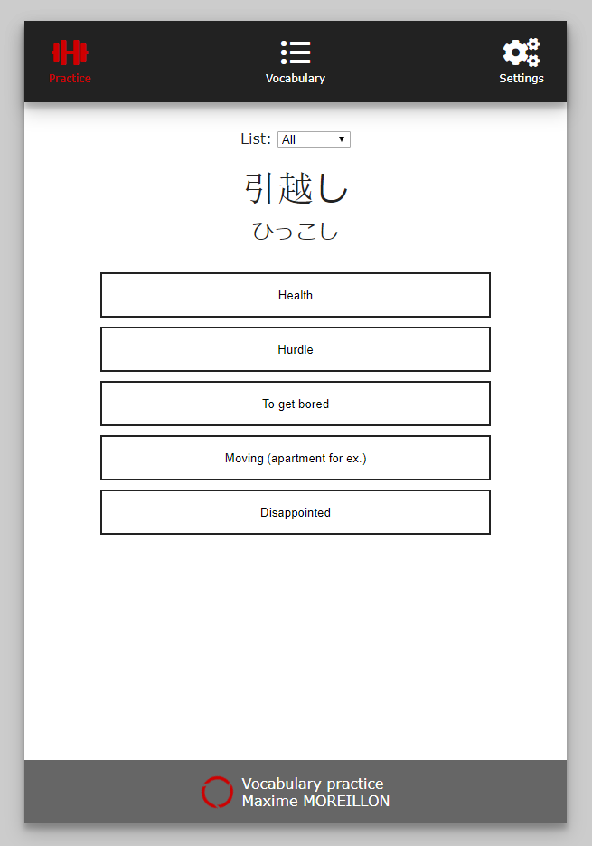

When learning a new language, there is no way around having to learn its vocabulary. This simple web app was made to help with this process by providing a multiple choice question style UI. It was designed mainly for Japanese, which uses Chinese characters that can have multiple readings.

The app is built using a simple combination of HTML/CSS for the front end and PHP for the back end, with a MySQL database is used to store vocabulary and users.

The development of this app was mainly a way to learn about PHP. For those interested in the source code, it is available on [GitHub](https://github.com/maximemoreillon/vocabulary) .

