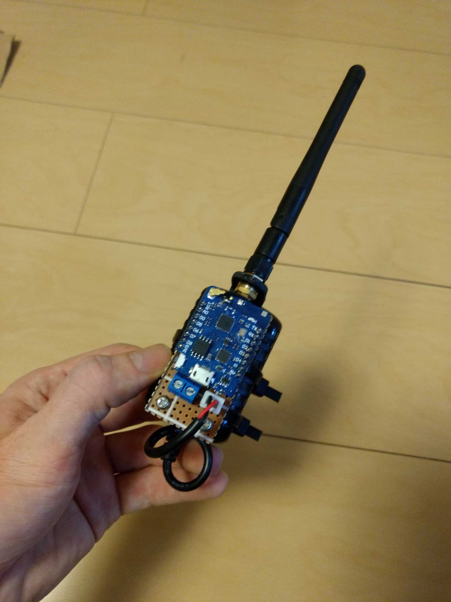
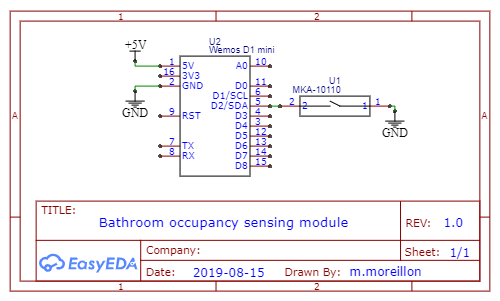

One of the companies I used to work for had a serious bathroom issue: My floor had only three toilet stalls for about 200 employees. There were countless times when I would walk all the way to the bathroom only to find all stalls occupied. I built this simple system to quickly identify whether one or more stall were. It consists of an IoT sensor installed on the bathroom stalls' door and an indicator placed somewhere easily visible.

The indicator simply consists of a SONOFF B2 with a custom firmware.

The sensors, on the other hand, are built using a reed switch connected to an ESP2866. Luckily for me, the stalls' door would rest in an open position unless locked. Thus, all I needed to do was using the reed switch to check if the door was closed.

Here, the SONOFF B2 hosts a simple web server to which the sensors send messages using HTTP according to their occupancy. The SONOFF then changes its color according to the overal occupancy

Source code available on GitHub:

* [Sensor](https://github.com/maximemoreillon/bathroom_occupancy_monitor_sensor)
* [Indicator](https://github.com/maximemoreillon/bathroom_occupancy_monitor_indicator)