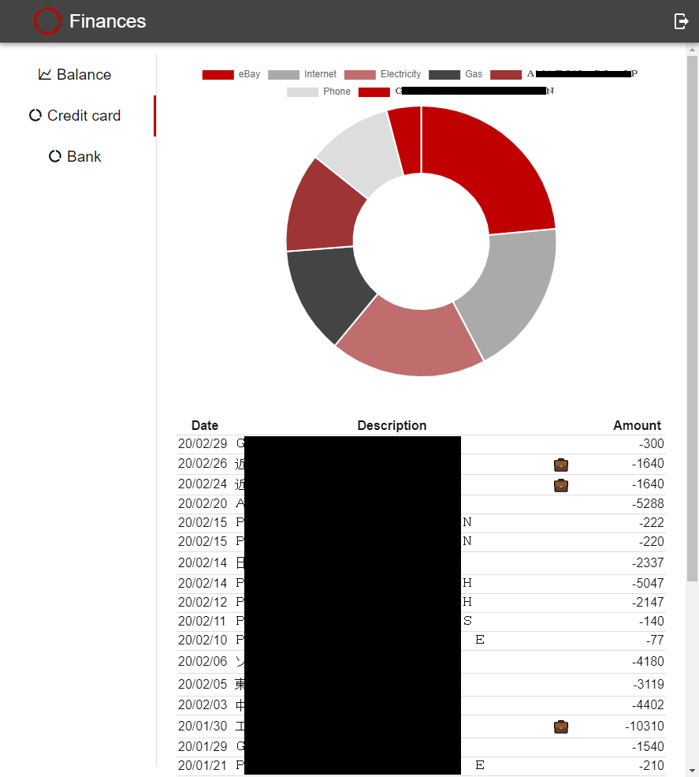

Most banks nowadays provide e-banking interfaces that allow clients to monitor the state of their accounts. However, each bank has its own system and the provided interfaces sometimes lack functionalities. Consequently, I decided to create my own finance dashboard, that combines information regarding multiple accounts. Currently I use it to keep track of my bank accounts balance over time as well as provide a breakdown of my transactions.

The back-end of the application is built using NodeJS while data is stored in a MongoDB collection for transactions and InfluxDB for the balance history. On the other hand, the front end is built using VueJS and uses ChartsJS for plots.

The source code of this application is available on GitHub:

* [Back-end](https://github.com/maximemoreillon/finances)
* [Front-end](https://github.com/maximemoreillon/finances_front)