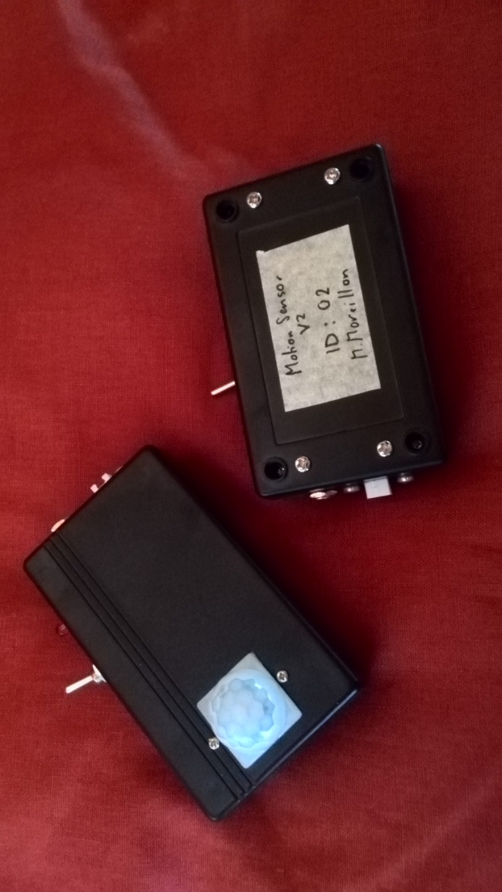
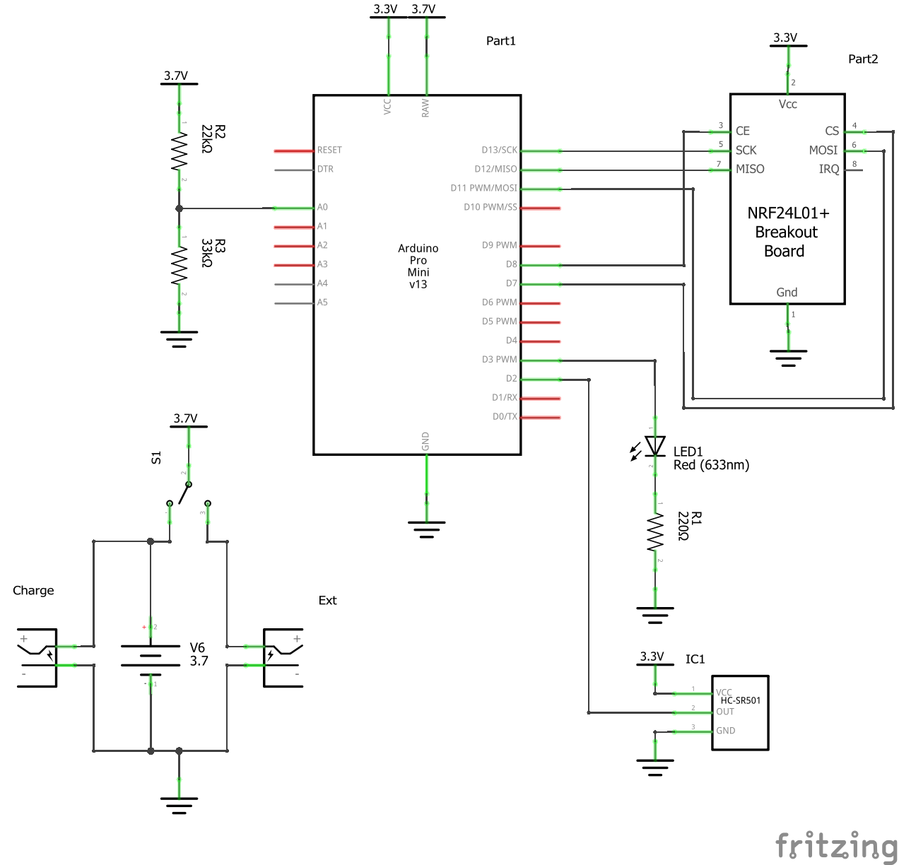
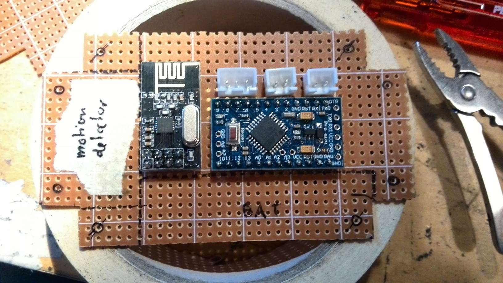

This is a wireless motion sensor that runs on rechargeable batteries. It can be deployed anywhere and sends a signal using an NRF24L01 wireless module whenever it detects motion.

The device is composed of the following parts

* Arduino pro mini
* NRF24L01+ wireless transceiver
* HC-SR501 PIR motion sensor
* 14500 Lithium-ion battery
* LED + resistor
* Power switch
* 5.5mm x 2.1mm DC socket
* 2P JST-XH connector for battery charging

Those are laid out as follows

Here, simple protoboard has been used for the assembly.

The source code for the firmware running on the Arduino is available on [GitHub](https://github.com/maximemoreillon/wireless_motion_sensor).