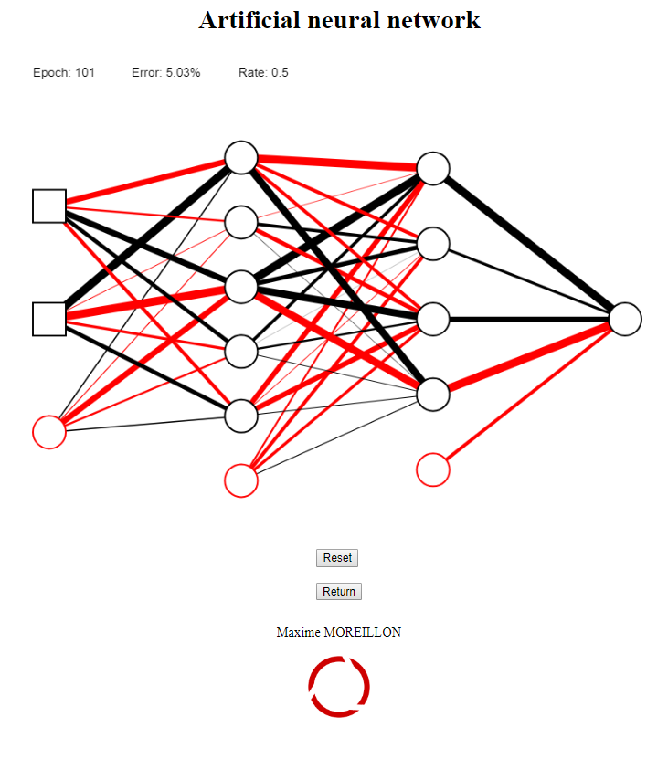

This simple web app written in JavaScript which trains a neural network on data provided as .csv file. The neural network is a fully connected network implemented from scratch and the structure of its hidden layers can be set by the user. The dimension of its inputs and outputs is automatically adjusted to fit the provided training data.

The app provides a visual representation of the network's neurons and synapses, which is updated at each training iteration. The synapses are shown in red if their weight is positive and black otherwise. Their thickness varies with the absolute value of the weight.

The parsing of the .csv files is done with some simple PHP.

The source code is available on [Github](https://github.com/maximemoreillon/js_neural_network)
