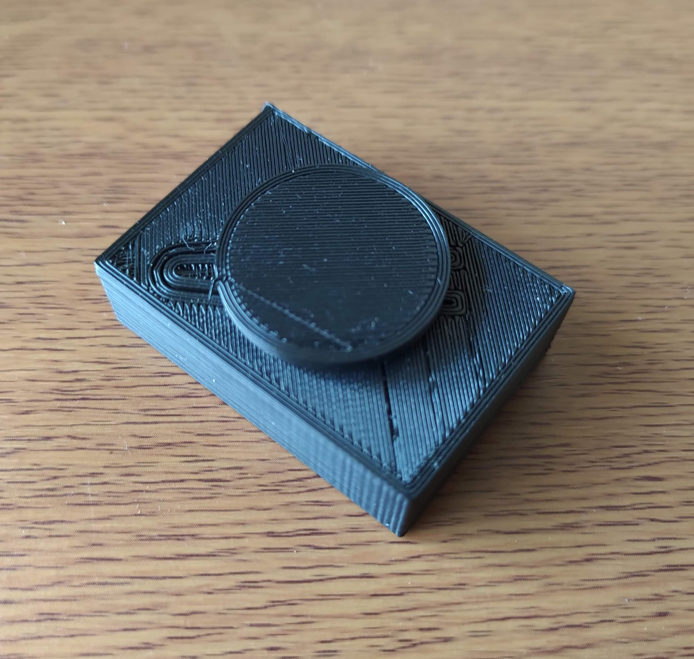
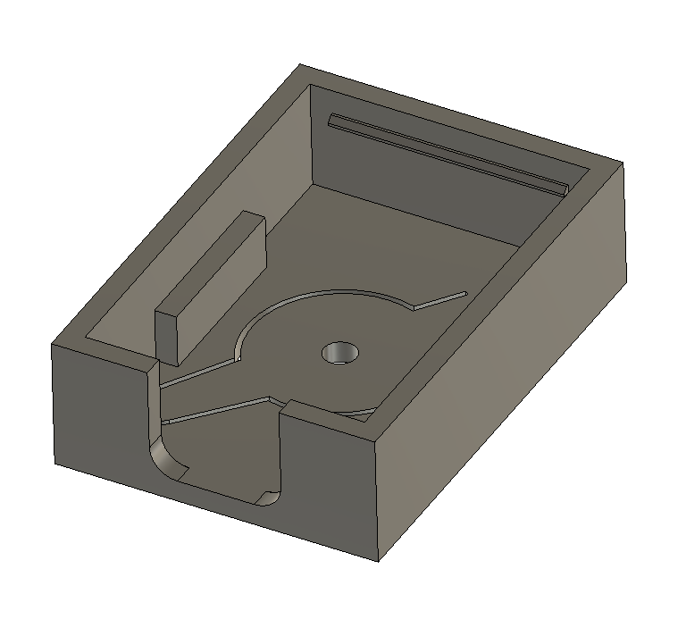
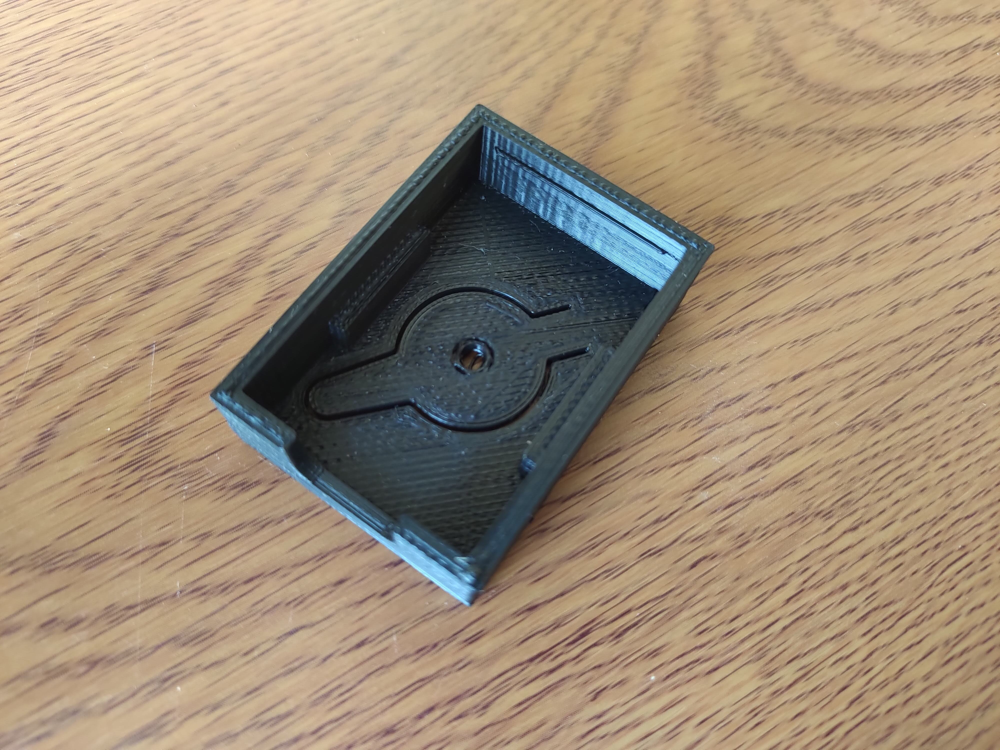
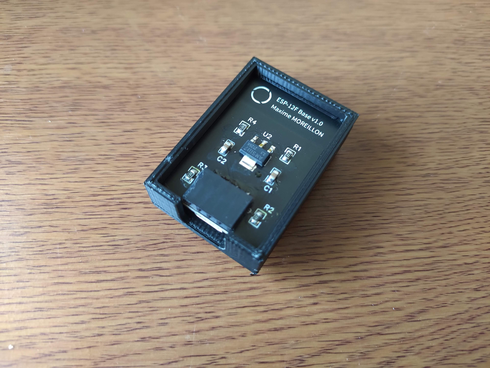

Over the years, I have built multiple IoT devices ranging from AC controllers to ceiling lights. Usually, I would control those devices using my smartphone or computer but sometimes a physical button can be more convenient. Thus, I designed this simple IoT button which publishes MQTT messages when pressed.

At its core, the button integrates my ESP12-F base PCB, which features a switch connected to GPIO0 used to put the ESP8266 in programming mode. After a successful boot, the GPIO0 can be used freely so I wrote a simple firmware that publishes an MQTT message when the pin gets pulled LOW.

Since the switch on the PCB rather tiny, I designed 3D printed an enclosure for the board which increases the surface that can be pressed.

The enclosure is printed as a single part and requires no screws as the PCB is secured via plastic clips.

