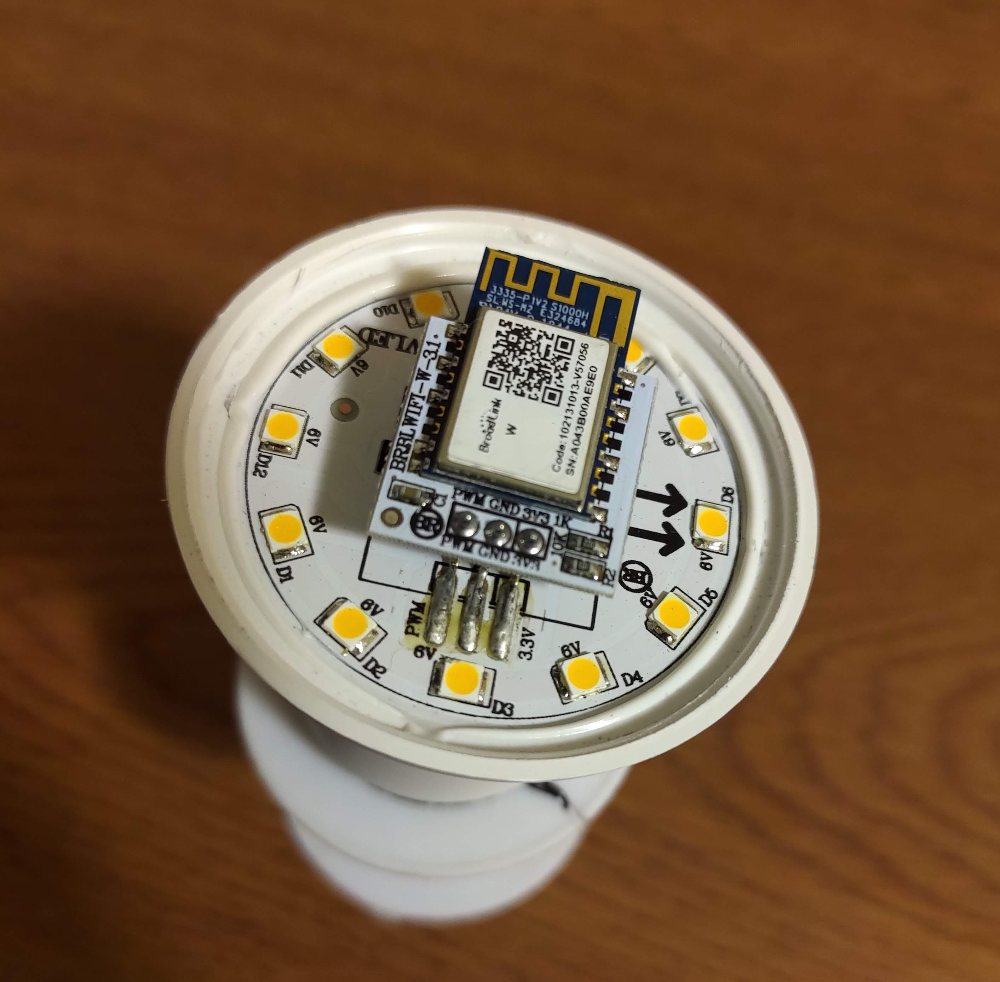
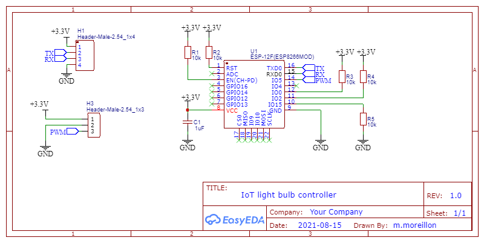
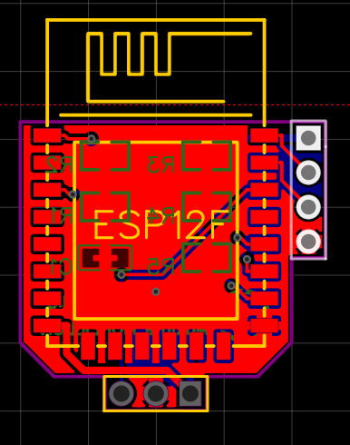
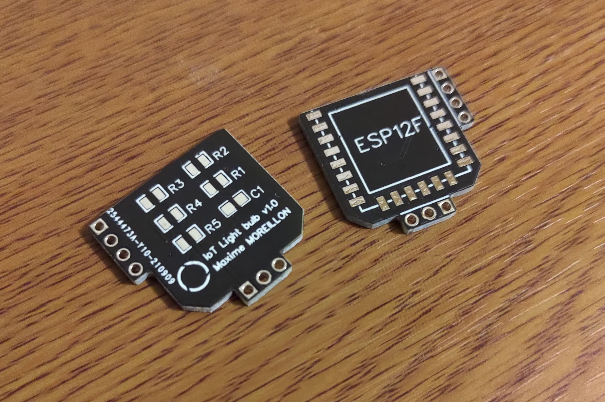
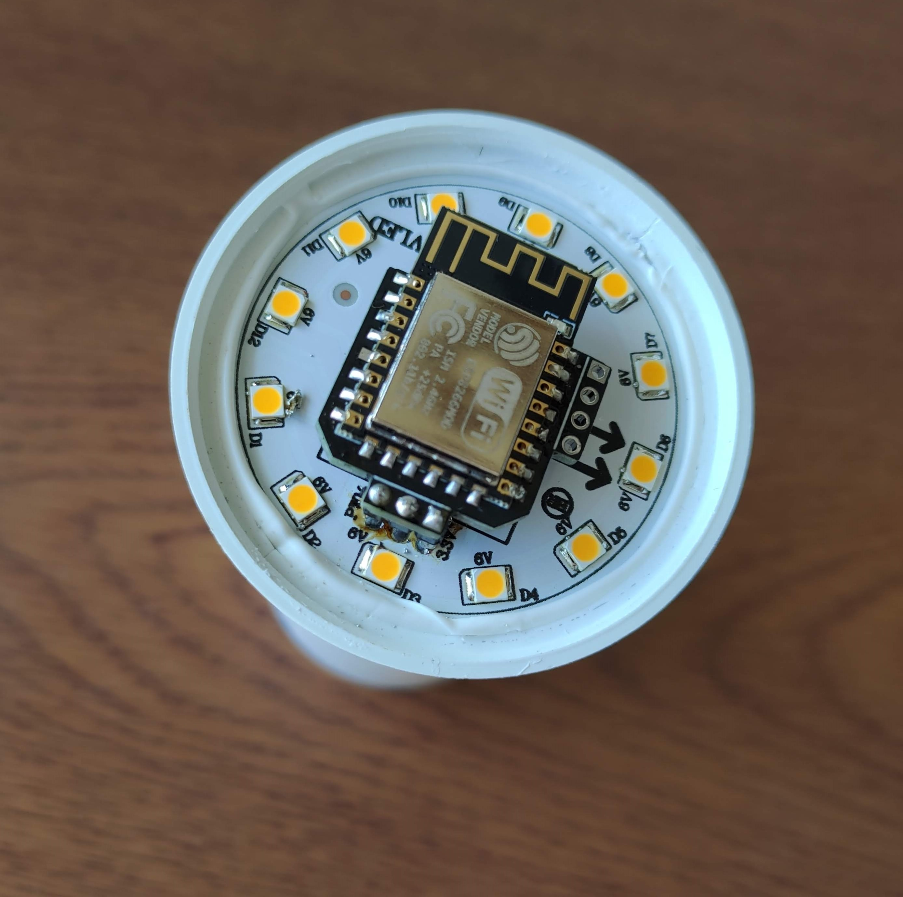

Wifi controlled smart light bulbs can now be purchased from less than USD 10. However, those can often only be used by a specific application provided by the vendor and can involve exchanging data with a third party server. I wanted a solution to use my own software while benefiting from the cheap hardware so I replaced the wifi module of a a cheap Wifi light bulb my own electronics.

Here are the original insides of the light bulb:

The Wifi module is a simple daughter board soldered to the LED and power electronics. They are connected via 3 pins, GND, VCC and a PWM signal produced by the wifi module to control the LED brightness.

As such, this Wifi module is easily replaceable by an ESP12-F carrier board as long as the former exposes the same interface. Thus, I designed such carrier board and here is its schematic:

Since the space available inside the light bulb is limited, I designed the PCB to be as compact as possible:

The PCB was then manufactured by JLCPCB:

With the components soldered on the board, the latter could then be installed in the bulb:

The source code for the firmware running on the ESP8266 is available on [GitHub](https://github.com/maximemoreillon/iot_light_bulb).

More info about the hardware on [OSHWLab](https://oshwlab.com/m.moreillon/iot_bulb)