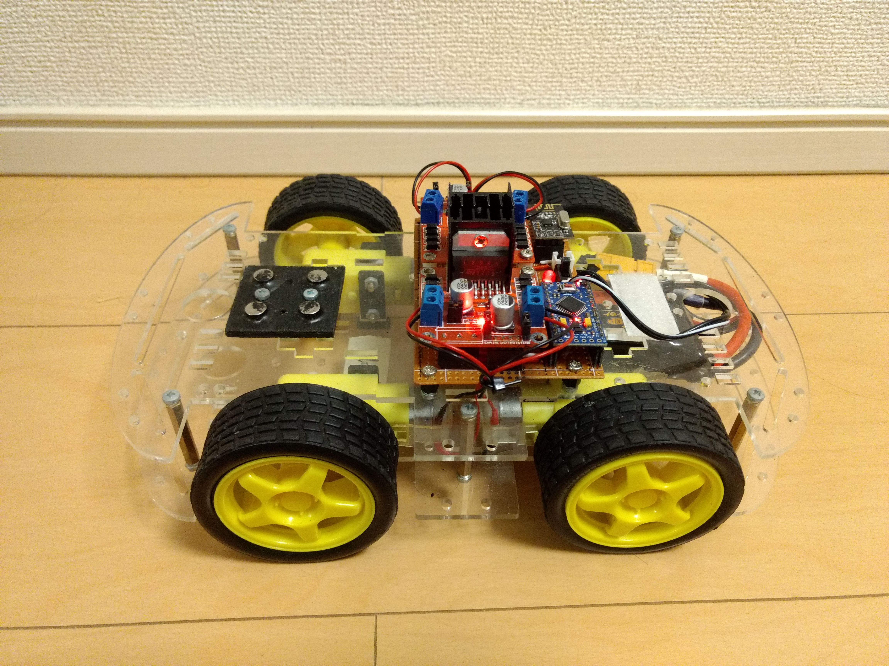
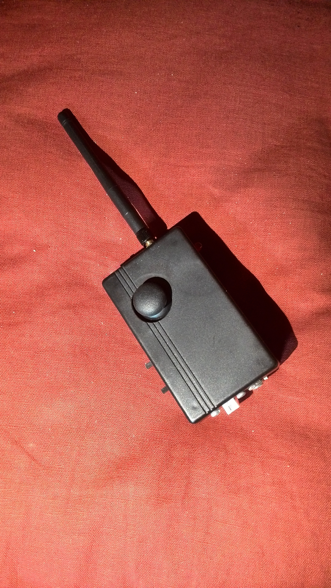
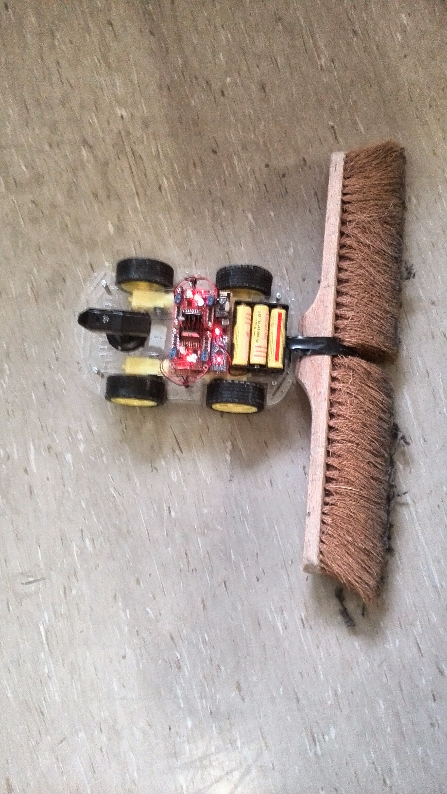
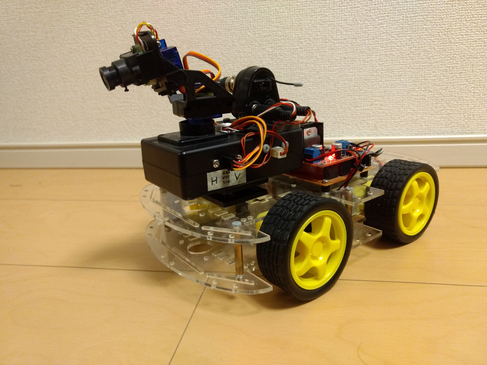
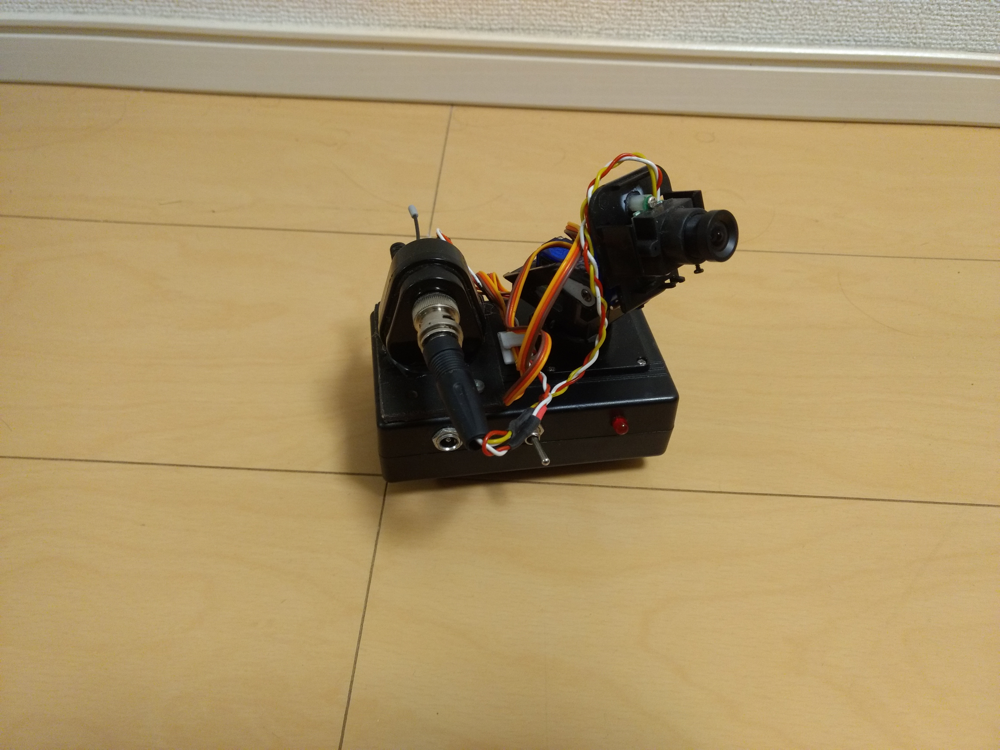

I found a cheap 4 wheel drive chassis on eBay and decided to make a remote controlled robot out of it. Thus, I made a simple board with two H-bridge modules, an NRF24L01 wireless module and Arduino pro mini.

To control the robot, I designed a simple remote controller with an Arduino pro-mini, joystick and NRF24L01 module

As it is, the robot was not very useful, even when displaying some creativity.

So, I decided to add a wireless camera at the front of the robot, mounted on a DIY pan-tilt platform

As such, I could drive the robot around while watching the video stream from my HUD google for instance.

Here is another picture of the camera platform by itself:

