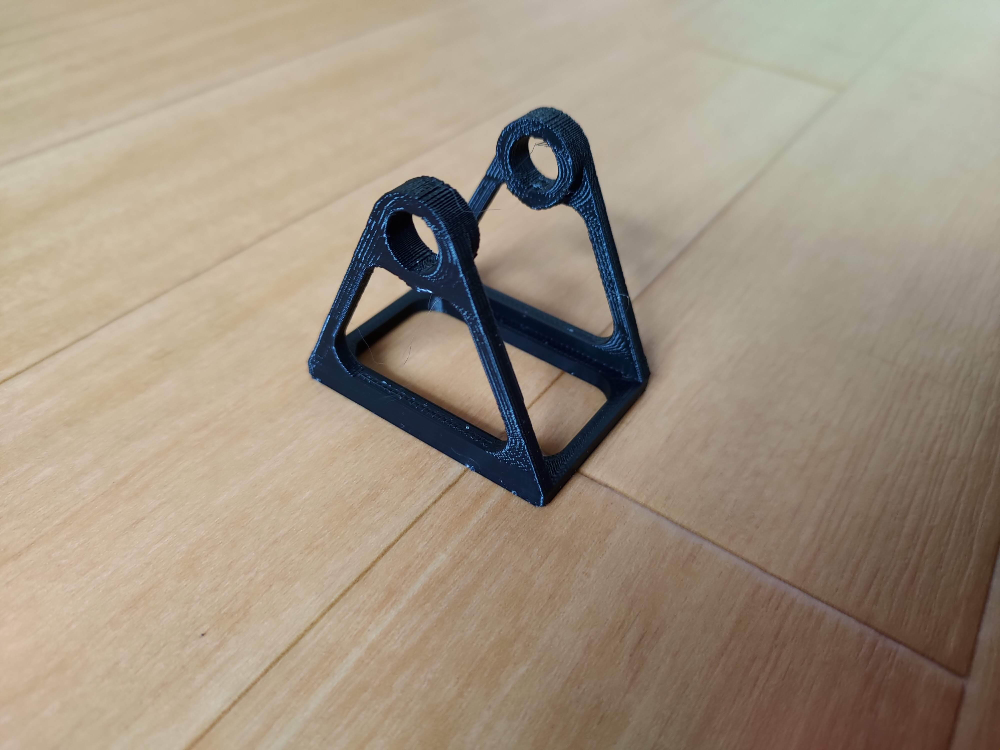
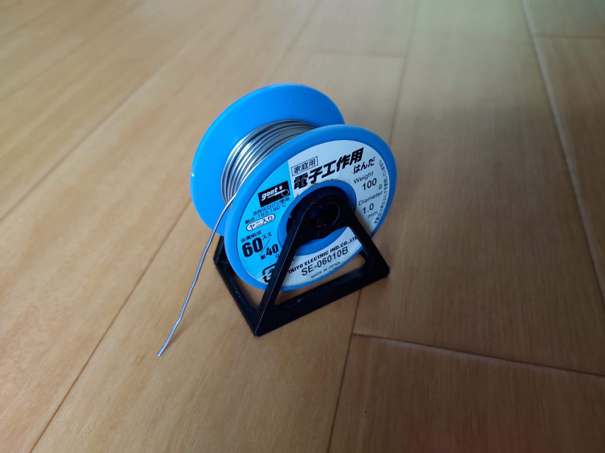

One day I got fed up with my solder spool rolling around all the time so I designed this simple spool holder in Fusion360 and 3D printed it.

The STL files for this project are available on [Thingiverse](https://www.thingiverse.com/thing:5145144)