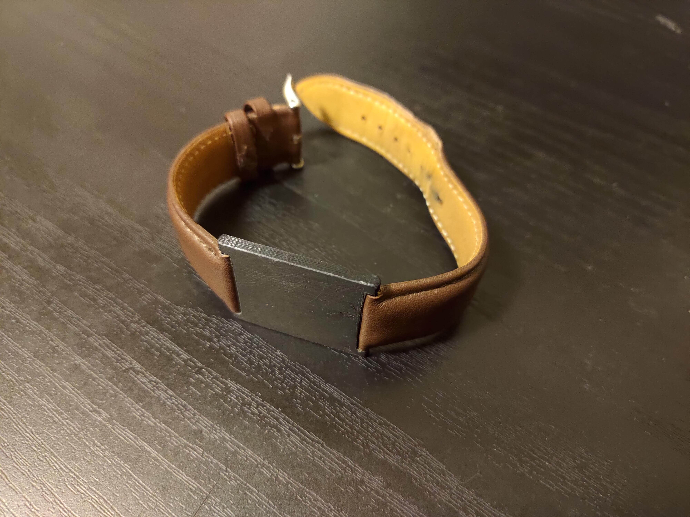
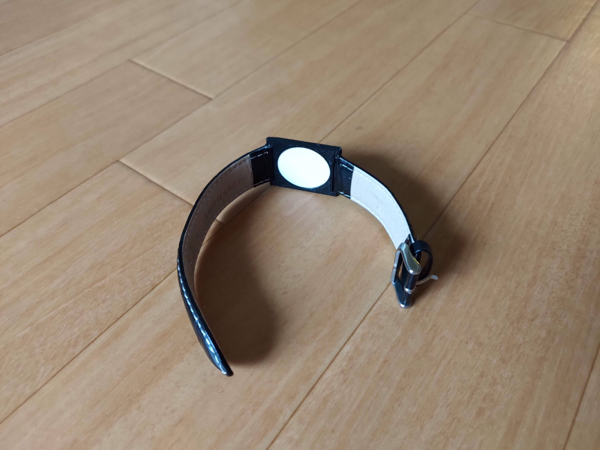

RFID tags are great but often easy to lose. To solve this problem, I designed this case for an RFID tag, which can be worn on one's wrist using a standard watch strap. The case was designed using Fusion360 and then 3D printed.

The RFID tag is slim enough to fit in the enclosure and is secured using the provided adhesive

The STL file for this project is available on [Thingiverse](https://www.thingiverse.com/thing:5145141)