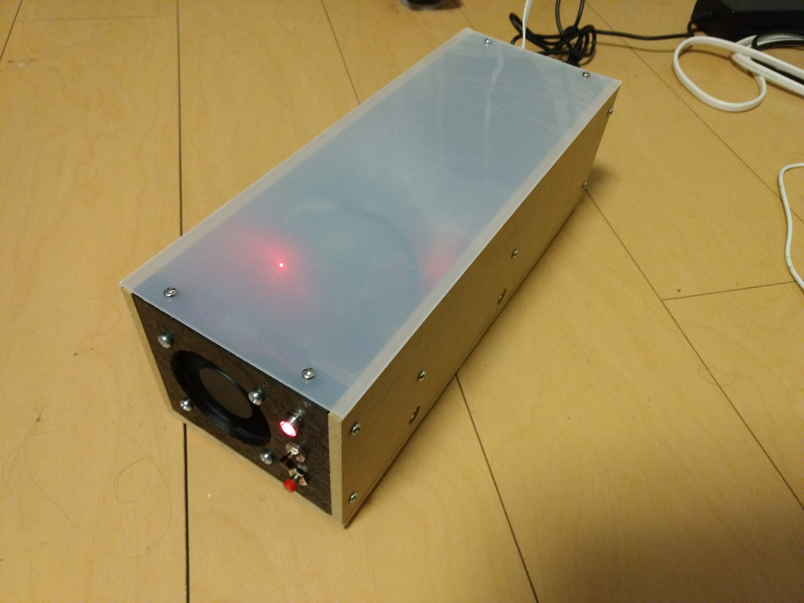
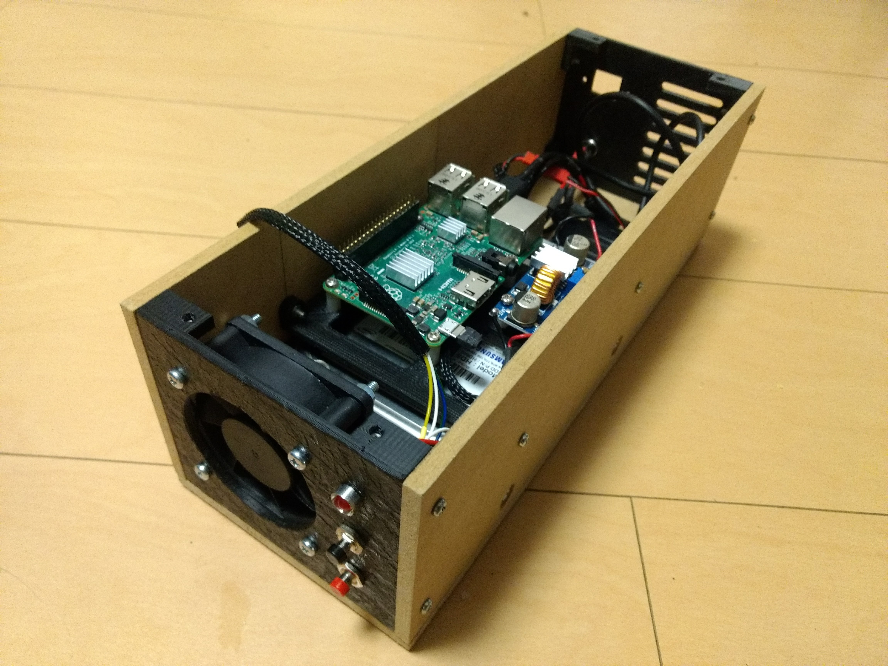

This is a simple Raspberry Pi based NAS. It features, as the title suggests, a Raspberry Pi as well as a 1TB 3.5'' HDD, interfaced with a USB to SATA converter.

The NAS is self-contained in a enclosure made of wood, Acrylic and 3D printed parts.

