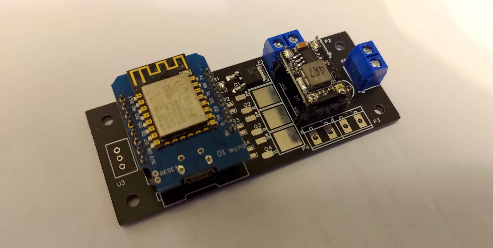
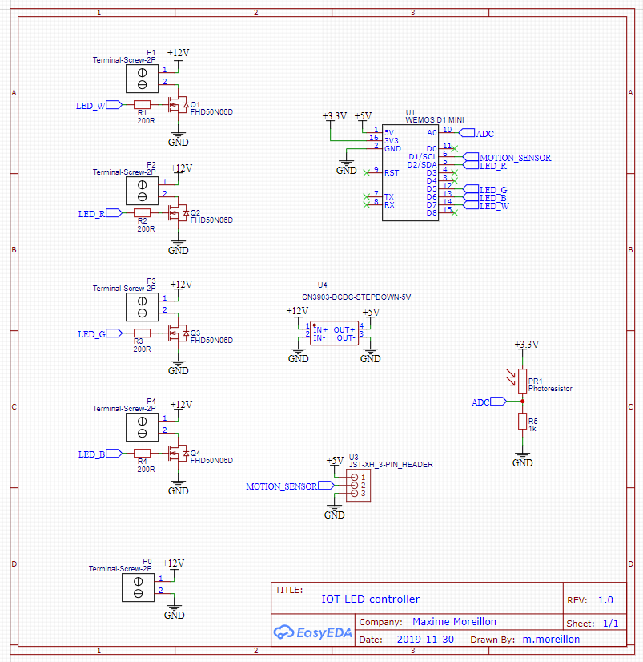
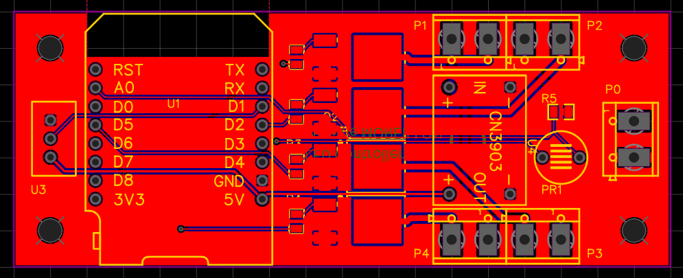

Smart lights are usually some of the first appliances to be added to a smart home. Although those can nowadays be purchased easily from various brands, I wanted to have my own hardware so as to integrate it better with other devices and software. Thus, I decided to an IoT LED controller that I can use in various projects where lighting has to be controlled via network protocols.

## Hardware

The controller is built around an ESP8266 microcontroller (Wemos D1 mini) and N-Channel MOSFETS. The latter switch the 12V line of LED strips or COBs according to the microcontroller. Here, up to 4 channels of LEDs can be controlled by a single controller.

The PCB has been designed using EasyEDA and manufactured by JLCPCB.

The schematic and PCB files are available on [OSHWLab](https://oshwlab.com/m.moreillon/led_ceiling_light_controller).

## Software

The controller is driven by a simple firmware, written as an Arduin sketch. Its source code is available on [GitHub](https://github.com/maximemoreillon/led_controller).