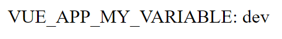
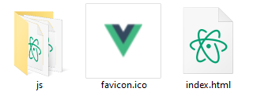
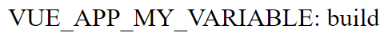
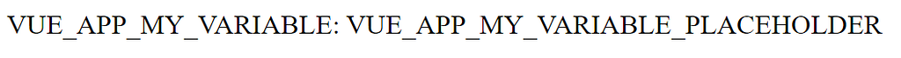
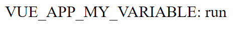

Note: this article is mirrored on [Medium](https://moreillon.medium.com/environment-variables-for-containerized-vue-js-applications-f0aa943cb962).

Environment variables can be used in a Vue.js application but those get converted into their hardcoded value during build. Thus, those variables cannot be changed to fit their environment at runtime. This article presents a method to circumvent the problem and allow the setting of environment variables at runtime.

## An example Vue.js application

Let us consider the following Vue.js application. All this application does is display the value of the environment variable `VUE_APP_MY_VARIABLE`.

```vue
<template>
  <div>VUE_APP_MY_VARIABLE: {{my_variable}}</div>
</template>

<script>
export default {
  name: 'App',
  data: () => ({
    my_variable: process.env.VUE_APP_MY_VARIABLE
  })
}
</script>
```

As described in the [official documentation](https://cli.vuejs.org/guide/mode-and-env.html), Vue.js reads environment variables defined in .env files. For convenience, variables corresponding to the development and production environments can be distinguished by using the .env.development and .env.production files respectively.

## Development environment

So, let’s start by configuring our `VUE_APP_MY_VARIABLE` variable for the development environment by creating a .env.development file with the following content:

```
VUE_APP_MY_VARIABLE=dev
```

If we run the application in the development server

```bash
npm run serve
```

We can see that our environment variable is set properly



*Our environment variable set correctly for our development environment*

## Build

Now we want to build our application for production. This implies that the `VUE_APP_MY_VARIABLE` should be set to its production value. Here, we might want to deploy the application to various production environments so for now we will just set the value to *build* in the .env.production file:

```
VUE_APP_MY_VARIABLE=build
```

We can build the application as follows:

```bash
npm run build
```

As a result, we now have the *dist* directory which contains the static files that constitute our application



*The content of the dist directory*

Here, we can try to serve the application using [http-server](https://www.npmjs.com/package/http-server) to check how it behaves

```bash
http-server ./dist
```

As expected, the our environment variable has been set according to our settings:



*The environment variable successfully taken the build value*

## Containerization

Now let us imagine we want to deploy the application to our production environment. For this purpose we will containerize it using Docker, which can be achieved following official [Vue.js documentation](https://cli.vuejs.org/guide/deployment.html#docker-nginx). We start by creating a Dockerfile for the application with the following content:

```dockerfile
FROM node:14 as build-stage
WORKDIR /app
COPY package*.json ./
RUN npm install
COPY ./ .
RUN npm run build

FROM nginx as production-stage
RUN mkdir /app
COPY --from=build-stage /app/dist /app
COPY nginx.conf /etc/nginx/nginx.conf
```

Here, the built application is to be served in an NGINX container. Here, NGINX must be configured for our needs, which is achieved with the following file, nginx.conf, which will also be included in the container:

```nginx
user  nginx;
worker_processes  1;
error_log  /var/log/nginx/error.log warn;
pid        /var/run/nginx.pid;
events {
  worker_connections  1024;
}
http {
  include       /etc/nginx/mime.types;
  default_type  application/octet-stream;
  log_format  main  '$remote_addr - $remote_user [$time_local] "$request" '
                    '$status $body_bytes_sent "$http_referer" '
                    '"$http_user_agent" "$http_x_forwarded_for"';
  access_log  /var/log/nginx/access.log  main;
  sendfile        on;
  keepalive_timeout  65;
  server {
    listen       80;
    server_name  localhost;
    location / {
      root   /app;
      index  index.html;
      try_files $uri $uri/ /index.html;
    }
    error_page   500 502 503 504  /50x.html;
    location = /50x.html {
      root   /usr/share/nginx/html;
    }
  }
}
```

Additionally, we want the container to hold a fresh install of the application so we’ll configure docker to ignore the *node_modules* and previous *dist* directories. This is done using a .dockerignore file with the following content:

```
**/node_modules
**/dist
```

The application container image can then be built using the docker command:

```bash
docker build -t my-vue-app .
```

Once build, a container can be started using the image. Here we will use the -e flag to set our environment variable:

```bash
docker run -e VUE_APP_MY_VARIABLE=run -p 8080:80 my-vue-app
```

However, accessing the application served by the container reveals that our environment variable setting has not been acknowledged:


*The environment variable did not take the value we specified*

So what is happening?

It turns out that during build, environment variables are injected into the application. The resulting static files thus contain the respective values of those variables as hardcoded strings.

Luckily, [StackOverflow user NehaM proposes a solution to the problem](https://stackoverflow.com/a/57928031/12312215), which will be explained in the following section.

## Substitution of variables after build

We start by setting our production environment variables to strings that can easily be parsed in the built application. Here, a simple option is to set the variable value to its actual name, suffixed by *_PLACEHOLDER.*

```
VUE_APP_MY_VARIABLE=VUE_APP_MY_VARIABLE_PLACEHOLDER
```

With that done, the building and running the container yields the following:



*Using a temporary placeholder for our variables*

In this state, the situation does not seem to have progressed much. However, our variables can now be easily found in the static files generated during build. Thanks to this, we can create a bash script, *substitute_environment_variables.sh*, that goes through all files of the *dist* folder and replaces instances our _PLACEHOLDER values with actual environment variables. This substitution is performed by the *sed* command.

```sh
#!/bin/sh
ROOT_DIR=./dist

# Replace env vars in files served by NGINX
for file in $ROOT_DIR/js/*.js* $ROOT_DIR/index.html $ROOT_DIR/precache-manifest*.js;
do

  sed -i 's|VUE_APP_MY_VARIABLE_PLACEHOLDER|'${VUE_APP_MY_VARIABLE}'|g' $file
  # Your other variables here...

done
```

To test this, let’s go ahead and set the `VUE_APP_MY_VARIABLE` environment variable and then run our script:

```bash
export VUE_APP_MY_VARIABLE=run
bash ./substitute_environment_variables.sh
```

Serving the *dist* directory with http-server shows that the `VUE_APP_MY_VARIABLE_PLACEHOLDER` has been successfully substituted with our environment variable:



*The environment variable has successfully taken the value of our environment*

## Substitution of variables at container runtime

Now, we need to get this script executed whenever the container is started, i.e. at container runtime. Consequently, we need to modify the dockerfile so as to run the *substitute_environment_variables.sh* file instead of running the NGINX server directly. Here, this can be achieved by copying *substitute_environment_variables.sh* into the /docker-entrypoint.d/ folder of the container

```dockerfile
# Build the Vue app
FROM node:14 as build-stage
WORKDIR /app
COPY package*.json ./
RUN npm install
COPY ./ .
RUN npm run build

# Copy the built app in an NGINX contaier
FROM nginx as production-stage
RUN mkdir /app
COPY --from=build-stage /app/dist /app
COPY nginx.conf /etc/nginx/nginx.conf

# Running the script at container run
COPY ./substitute_environment_variables.sh /docker-entrypoint.d/substitute_environment_variables.sh
RUN chmod +x /substitute_environment_variables.sh
```

However, we will need to adapt our file to use the correct directory for substitution. Additionally we need to let the NGINX usual startup to continue by adding *exec “$@”* at the end of our script:

```sh
#!/bin/sh

ROOT_DIR=/app

# Replace env vars in files served by NGINX
for file in $ROOT_DIR/js/*.js* $ROOT_DIR/index.html $ROOT_DIR/precache-manifest*.js;
do
  sed -i 's|VUE_APP_MY_VARIABLE_PLACEHOLDER|'${VUE_APP_MY_VARIABLE}'|g' $file
  # Your other variables here...
done

# Let container execution proceed
exec "$@"
```

And with that done, Our container now sets our environment variables to the values provided at runtime instead of build time.

## Conclusion

Because Vue.js converts environment variables into hardcoded strings at build time, setting environment variables during container runtime is challenging. With the method presented in this article, temporary placeholder variables are set at build time and then substituted at runtime. This provides Vue.js apps with an extra layer of customization options for their operators. The source code for the example application presented in this article is available on [GitHub](https://github.com/maximemoreillon/vue-runtime-env).

This technique has since been [adapted to Vue 3 and Vite](/articles/vue-runtime-env-vite-migration/) and [made generic](/articles/generic-vite-runtime-env-script/), so that it no longer needs to be edited for every new variable.
